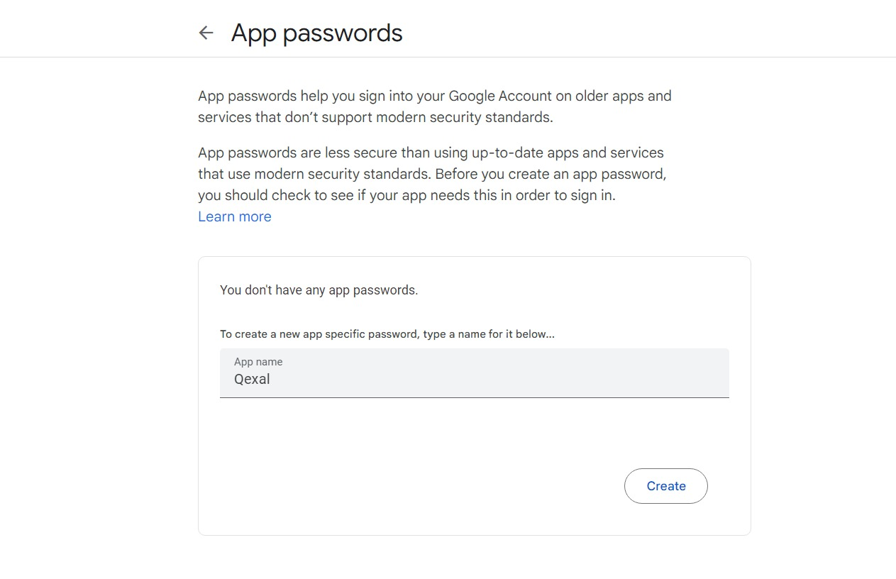
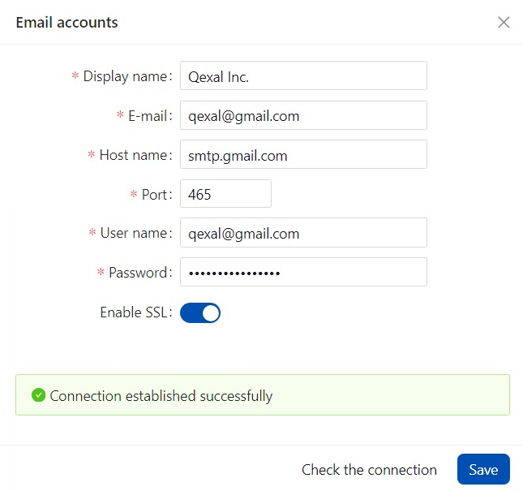

# Google

## Introduction

Google SMTP (Simple Mail Transfer Protocol) allows you to send emails through Google's servers. This document provides instructions on how to set up a connection to Google SMTP for sending emails from your application or website.

:::warning NOTE
Ensure that 2-step verification is already enabled in your Google Account.
:::

## Step 1: Enable Two-Factor Authentication

For security reasons, Google now requires Two-Factor Authentication to generate App Passwords.

1. Go to your [Google Account Security](https://myaccount.google.com/security).
2. Set up Two-Factor Authentication if not already enabled.

## Step 2: Generate an App Password

Now, generate an App Password fo application:

1. Visit the [App passwords page](https://myaccount.google.com/apppasswords).
2. Enter the name of application.
3. Click "Generate."
4. Note the generated password; you'll need it during configuration.

## Step 3: Configure SMTP

In the email settings should have SMTP settings for sending emails. Enter the following parameters:

- **Host name**: `smtp.gmail.com`
- **Port**: `465`
- **User name**: Enter the email address of the user who will be sending the emails.
- **Password**: Use the app password you generated in the previous step.
- **Enable SSL**: Ensure that this option is checked.

## Step 4: Test the Configuration

Send a test email to ensure that your configuration is working correctly.

This completes the setup! Now, Qexal should be configured to use Google SMTP for sending emails. Keep in mind that the use of Google SMTP may be restricted for accounts with enhanced security settings.