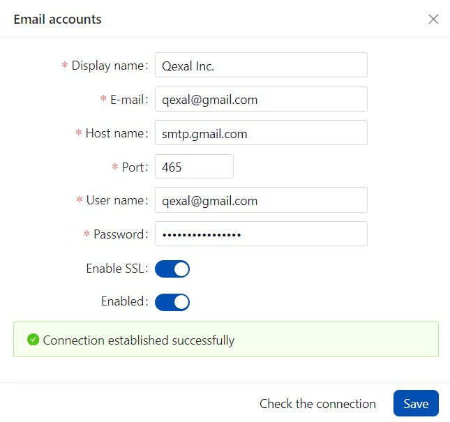
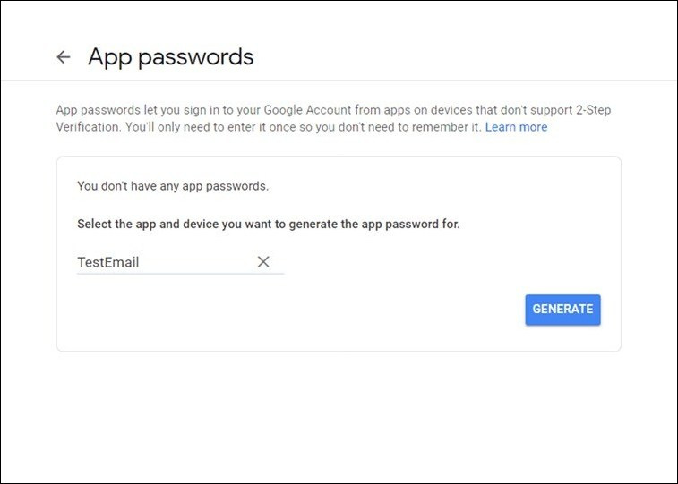

# SMTP Email Configuration

### Set-Up SMTP in Gmail

:::warning NOTE
Ensure that 2-step verification is already enabled in your Google Account.
:::

First, it is needed to set up SMTP in Gmail.

- **Host name**: Enter `smtp.gmail.com`.
- **Port**: Use `587` as the port number.
- **User name**: Provide the email address of the user who will be sending the emails.
- **Password**: Use the same password that you used when creating the app on your Google Account.
- **Enable SSL**: Ensure that this option is checked.

Proceed with the following steps:

1. Navigate to your Google Account settings by going to [App Passwords](https://myaccount.google.com/apppasswords).

2. Provide a name for the app (e.g., Qexal) and click `Generate`.

A password will be generated; make sure to copy it. You will use this password for email configuration. The user name will be the email address associated with your Google Account.
