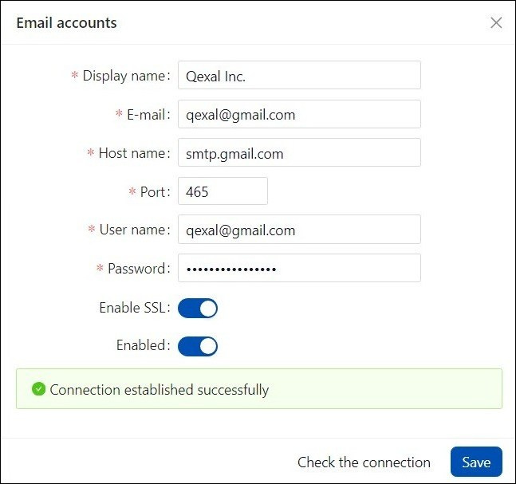

# SMTP Email Configuration

### Set-Up SMTP in Gmail

First, it is needed to set up SMTP in Gmail.

1. HOST NAME: Enter `smtp.gmail.com`.

2. PORT: Use `587` as the port number.

3. USER NAME: Provide the email address of the user who will be sending the emails.

4. PASSWORD: Use the same password that you used when creating the app on your Google Account.

5. ENABLE SSL: Ensure that this option is checked.

Proceed with the following steps:

1. Navigate to your Google Account settings by going to `Manage Google Account`.

2. In the Google account dashboard, click on `Security` and then select `App Passwords`.

:::warning NOTE
Ensure that 2-step verification is already enabled in your Google Account.
:::

3. Under the drop-down menu for `Select app`, choose `Other`.

4. Provide a name for the app (e.g., Qexal SMTP) and click `Generate`.

A password will be generated; make sure to copy it. You will use this password for email configuration. The user name will be the email address associated with your Google Account.
